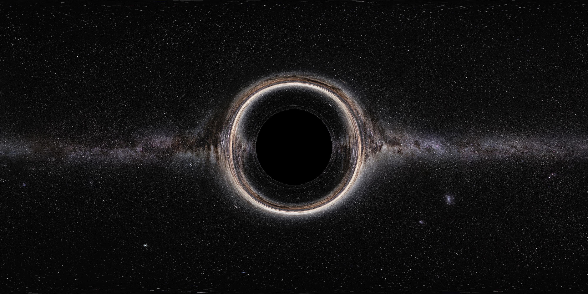

# EinFields

[](https://github.com/google/jax)
[](https://github.com/patrick-kidger/diffrax)
[](https://github.com/google/orbax)
[](https://github.com/google/flax)
[](LICENSE)

<div align="center">
  
  <p>Figure 1. EinFields black hole rendering with ray tracing. </p>
</div>

## Overview

This project accompanies our paper [Einstein Fields: A neural perspective to computational general relativity](https://arxiv.org/abs/XXXX.XXXXX).

**EinFields** (or **Einstein Fields**) is a comprehensive implicit neural representation framework for computational general relativity. It leverages **JAX's** functional programming paradigm for maximum compatibility and ease-of-use when combined with the mathematical structure of **tensor fields**. 

The **metric tensor**, the cornerstone of general relativity is parametrized by a neural network, providing a smooth and **continuous** alternative to conventional grid-based discretizations. Thanks to automatic differentiation, Christoffel symbols, Riemann tensor, and other geometric quantities are obtained with minimal loss in numerical precision. 

This approach exploits a fundamental property of gravity: every geometric object that encodes the physics depends only on the metric and its **first** and **second** derivatives.

### Key Features

- **Differential Geometry**: Automatic differentiation computation of Christoffel symbols, Riemann curvature tensors, and other geometric quantities
- **Multiple Coordinate Systems**: Support for Cartesian, spherical, Boyer-Lindquist, Kerr-Schild, and other coordinate systems  
- **Spacetime Metrics**: Built-in support for Minkowski, Schwarzschild, Kerr, and gravitational wave metrics
- **Neural Field Training**: Flexible training pipeline
- **Geodesic Solver**: Tools for computing and visualizing geodesics in spacetime
- **Data Generation**: Quick to use data creation for Sobolev supervision and validation.
- **Enhanced Performance**: Everything is compatible with **jax.jit** and **jax.vmap** for maximum efficiency.

## Get Started

```bash
git clone https://github.com/your-username/EinFields.git
cd /your_path/EinFields
```

Install the dependencies (ideally in a fresh environment), e.g. 
```
pip install -r requirements.txt
```

For the imports to work, you need to add this directory (adjust accordingly) to your PYTHONPATH. There are several options:

```
# On macOS/Linux
For run: PYTHONPATH=/your_path/EinFields python ...

For session: export PYTHONPATH=/your_path/EinFields in terminal

Permanently: export PYTHONPATH=/your_path/EinFields add to ~/.bashrc or ~/.bashrc or ~./zshrc etc.

# VSCode
Put PYTHONPATH=/your_path/EinFields in .../EinFields/.env;

Put "python.envFile": "${workspaceFolder}/.env" in settings.json;

Put "envFile": "${workspaceFolder}/.env" in launch.json if debugging is not working with the above.

# On Windows
set PYTHONPATH=/your_path/EinFields
```


The only major requirements is `jax`. For CUDA support install with `pip install -U "jax[cuda12]"` or consult the [guideline](https://jax.readthedocs.io/en/latest/installation.html) for your machine.

`pip` seems to work much better than `conda` since many packages are not supported properly on conda.

## Organization 
```
EinFields/
├── data_generation/                    
│   ├── generate_data.py                # Main data generation script
│   ├── utils_generate_data.py          # Data generation utilities
│   └── data_lookup_tables.py           # Metric and coordinate systems dictionaries
├── differential_geometry/              # Core differential geometry engine
│   ├── tensor_calculus.py              # Tensor operations
│   ├── vectorized_tensor_calculus.py   # Vectorized computations
│   └── examples/                       # Example notebooks
├── einstein_fields/                    # Neural field training framework
│   ├── main.py                         # Main training script
│   ├── train.py                        # Training loop implementation
│   ├── nn_models/                      # Neural network architectures
│   ├── configs/                        # Configuration files
│   └── utils/                          # Training utilities
├── general_relativity/                 # GR-specific implementations
│   ├── metrics/                        # Spacetime metric definitions
│   ├── geodesics/                      # Geodesic solver tools
│   └── coordinate_transformations/     # Coordinate system transformations
└── misc/                               # Miscellaneous files and figures
```

## Documentation

- **[Training Guide](How_to_train_EinFields.md)**: Comprehensive guide to training EinFields
- **[Examples](differential_geometry/examples/)**: Jupyter notebooks demonstrating framework usage
- **Configuration Templates**: Pre-configured YAML files in [`configs`](einstein_fields/configs/)

## Citation 
```
@misc{your_arxiv_citation,
      title={EINSTEIN FIELDS: A NEURAL PERSPECTIVE TO COMPUTATIONAL GENERAL RELATIVITY},
      author={Cranganore, Bodnar and Berzins},
      year={2025},
      eprint={XXXX.XXXXX},
      archivePrefix={arXiv},
      primaryClass={cs.AI}
}
```